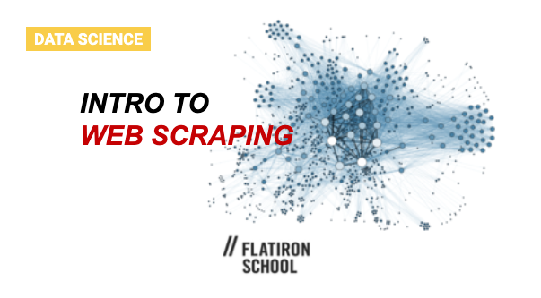

<h1>Intro to Web Scraping</h1>

>A code along workshop with Flatiron School. 

</img>

**To launch the notebook, [click here](https://mybinder.org/v2/gh/flatiron-school/intro_to_webscraping/master?filepath=%2Findex.ipynb) **

The contents of this notebook were first developed by [Joél Collins](https://github.com/joelsewhere), and utilizes the [Quotes to Scrape](http://quotes.toscrape.com/) website for demonstrating basic web scraping with Python. 

### Workshop Goals:
1. Retreive the HTML of a webpage with the `requests` library.
2. Introduction to the `tree` structure of `HTML`.
3. Use the `inspect` tool to sift through the HTML.
4. Parse HTML with the `BeautifulSoup` library.
5. Store data in a `csv` file using the `Pandas` library.

Workshop dates:
- 07/10/20

